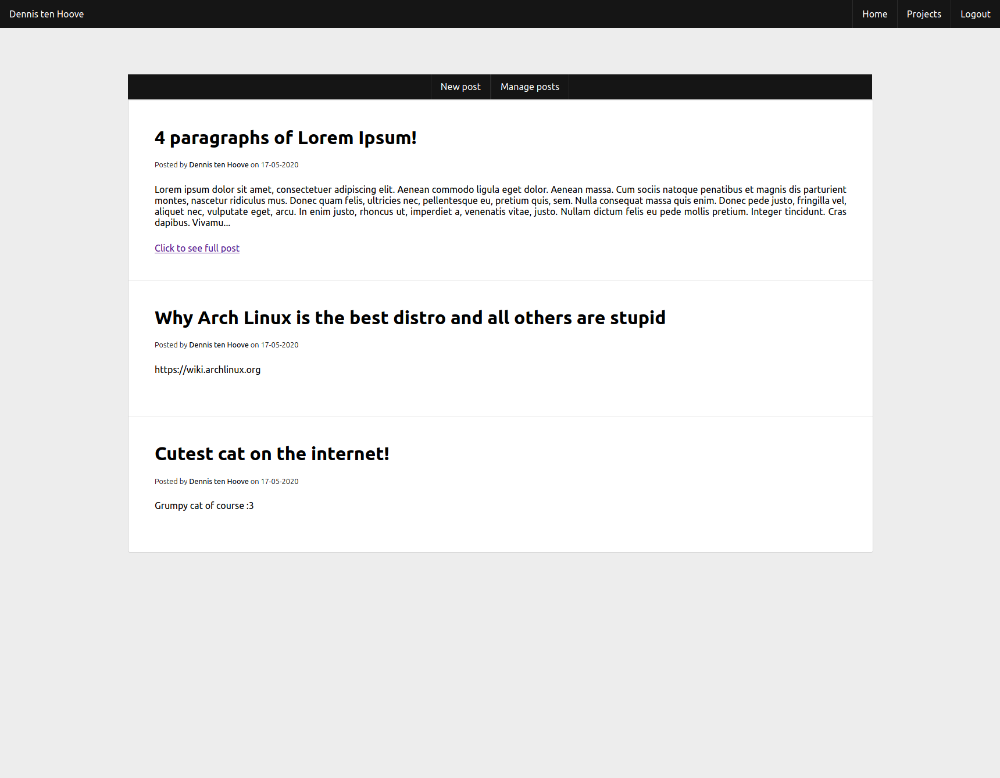

# Blog PHP
### What is this?
This is the source for my personal blog. It was made as a PHP learning project.

### Usage
- Place source on PHP capable webserver.
- Configure `/config/default.conf` and `/config/database.conf`

### Database configuration

```
blogphp +----+-----> posts +-+------> id +-------+ INT, Auto Increment
             |               |
             |               +------> title +----+ TINYTEXT
             |               |
             |               +------> image +----+ TEXT
             |               |
             |               +------> content +--+ LONGTEXT
             |               |
             |               +------> date +-----+ TINYTEXT
             |               |
             |               +------> owner+-----+ TEXT
             |
             |
             +-----> users +-+------> id +-------+ INT, Auto Increment
                             |
                             +------> userName +-+ TINYTEXT
                             |
                             +------> email +----+ TINYTEXT
                             |
                             +------> pwd +------+ LONGTEXT


```

# Example images


